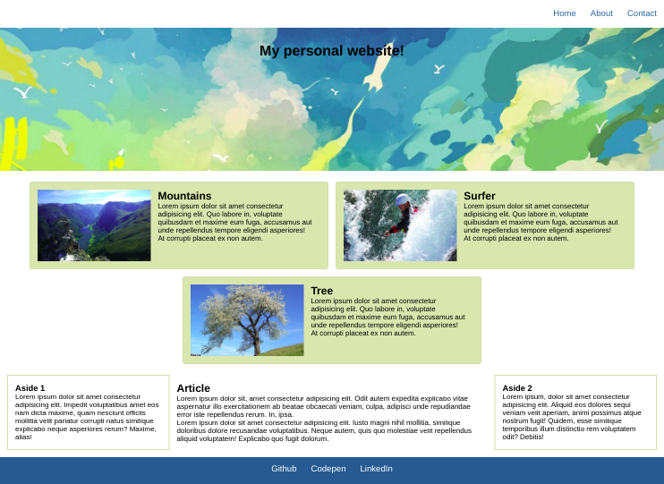
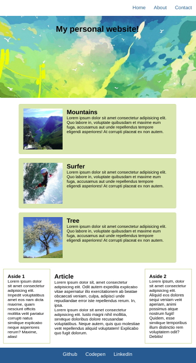
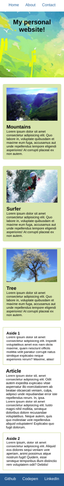

# SCSS Example - 1

This exercise focuses mainly importing files, variables, and @mixin topics.

Create a mockup website as seen in [this reference](https://hsnakk.github.io/scss_exer_1/).

### Unstructions:

* Use SCSS to create the mockup.
* Make use of nesting, variables, @import, and @mixin where possible.
* Make sure to design for mobile first!
* Breakpoints:
  * 768px - tablet
  * 1024px - desktop
* Colors for styling:
  * Card background color: #e0ddb2
  * Card and aside borders: #dad6ab
  * Color used for nav and footer: #016690
* Use the images in the images folder for the header and cards.

### Desktop design

### Tablet design

#### Mobile design

